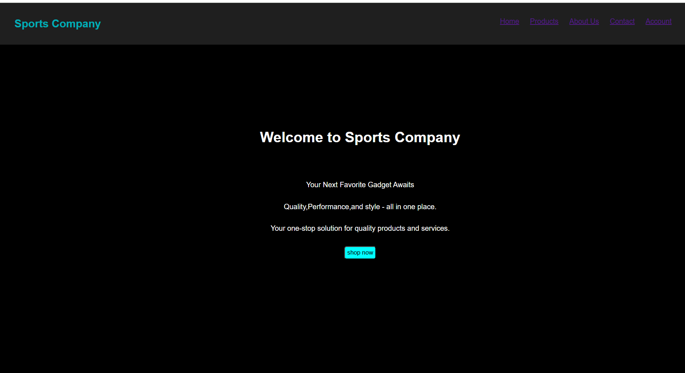
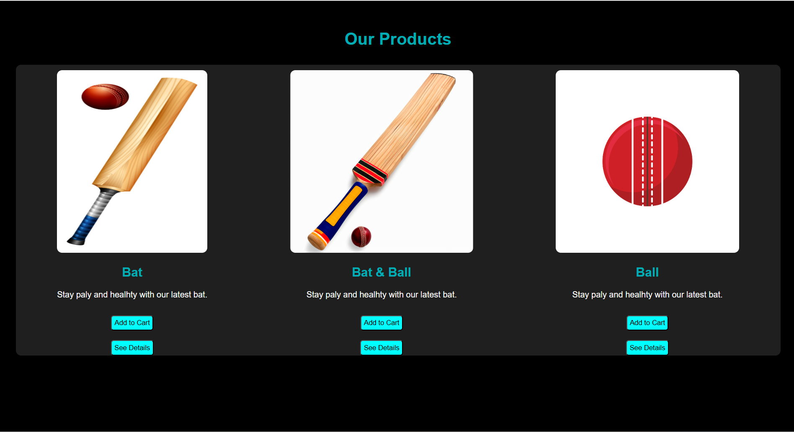
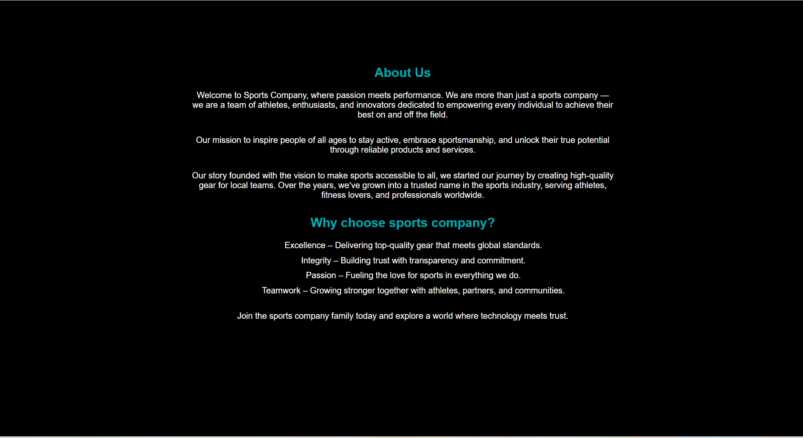
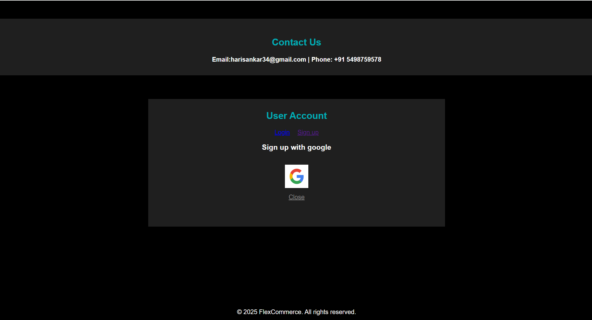
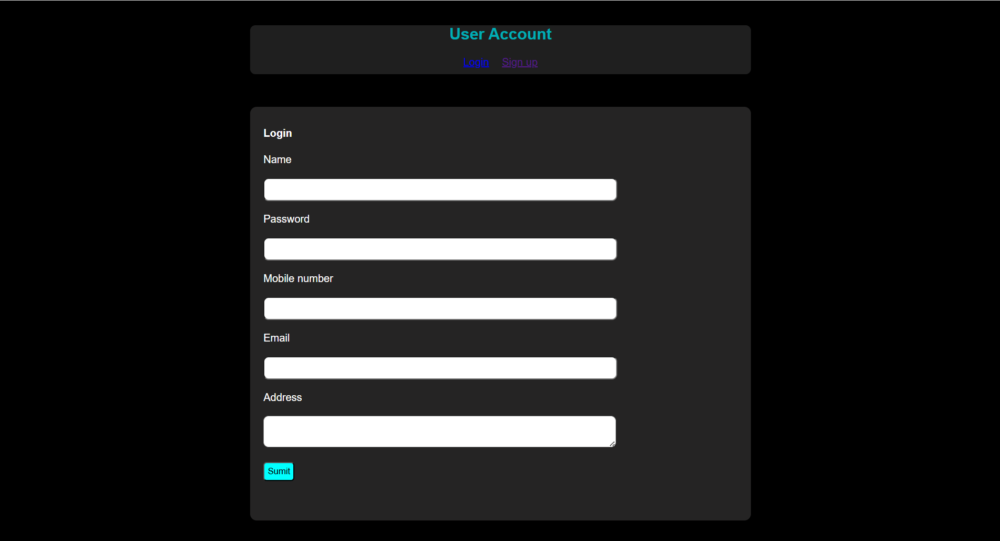

# Ex02 Commercial Website
## Date:8-09-2025

## AIM
To create a commercial website using CSS Flexbox.

## ALGORITHM
### STEP 1
Create an HTML file (index.html)

### STEP 2
Create a CSS file (style.css)

### STEP 3
Include a navigation bar with links to different sections.

### STEP 4
Add structured sections for Homepage, Products / Services, About Us, Contact Details and User Account.

### STEP 5
Include social media links at the footer with copyright information.

### STEP 6
Define global styles for fonts, colors, and layout.

### STEP 7
Style the header, navigation bar, and sections.

### STEP 8
Use Flexbox for layout design.

### STEP 9
Add hover effects and transitions for interactivity.

### STEP 10
Add Images and Media.

### STEP 11
Use optimized images for a professional look.

### STEP 12
Open the HTML file in a browser to check layout and functionality.

### STEP 13
Fix styling issues and refine content placement.

### STEP 14
Deploy the website.

### STEP 15
Upload to GitHub Pages for free hosting.

## PROGRAM
```
<!DOCTYPE html>
<html lang="en">
<head>
    <meta charset="UTF-8">
    <meta name="viewport" content="width=device-width, initial-scale=1.0">
    <title>Sports Company</title>
    <link rel="stylesheet" href="style.css">
</head>
<body>
    <header>
    <div class="logo">Sports Company</div>
    <nav>
      <ul class="nav-links">
        <li><a href="#index.html">Home</a></li>
        <li><a href="#product.html">Products</a></li>
        <li><a href="#about.html">About Us</a></li>
        <li><a href="#contact.html">Contact</a></li>
        <li><a href="#user.html">Account</a></li>
      </ul>
    </nav>
  </header>
  <!-- Home page -->
   <section class="homepage">
    <div class="page1">
    <h1>Welcome to Sports Company</h1><br><br>
    <p>Your Next Favorite Gadget Awaits</p>
    <p>Quality,Performance,and style - all in one place.</p>
    <p>Your one-stop solution for quality products and services.</p>
    <button class="btu">shop now</button>
    </div>
   </section>
   <!-- product page -->

   <div class="page3">
    <h1 id="hea">Our Products</h1>
    <section class="page2">
        
        <div>
            <br>
            <h2>Bat</h2>
            <p>Stay paly and healhty with our latest bat.</p>
            <button class="btu">Add to Cart</button><br><br>
            <button class="btu">See Details</button>
        </div>
        <div>
            <br>
            <h2>Bat & Ball</h2>
            <p>Stay paly and healhty with our latest bat.</p>
            <button class="btu">Add to Cart</button><br><br>
            <button class="btu">See Details</button>
        </div>
        <div>
            <br>
            <h2>Ball</h2>
            <p>Stay paly and healhty with our latest bat.</p>
            <button class="btu">Add to Cart</button><br><br>
            <button class="btu">See Details</button>
        </div>
    </section>
    </div>

    <!-- About page -->

    <div class="aboutpage">
        <h2>About Us</h2>
        <p>Welcome to Sports Company, where passion meets performance. We are more than just a sports company — we are a team of athletes, enthusiasts, and innovators dedicated to empowering every individual to achieve their best on and off the field.</p>
        <p>Our mission to inspire people of all ages to stay active, embrace sportsmanship, and unlock their true potential through reliable products and services.</p>
        <p>Our story founded with the vision to make sports accessible to all, we started our journey by creating high-quality gear for local teams. Over the years, we’ve grown into a trusted name in the sports industry, serving athletes, fitness lovers, and professionals worldwide.</p>
        <h2>Why choose sports company?</h2>
        <ul>
            <li>Excellence – Delivering top-quality gear that meets global standards.</li>
            <li>Integrity – Building trust with transparency and commitment.</li>
            <li>Passion – Fueling the love for sports in everything we do.</li>
            <li>Teamwork – Growing stronger together with athletes, partners, and communities.</li>
        </ul>
        <p>Join the sports company family today and explore a world where technology meets trust.</p>
    </div>

    <!-- contact page -->

    <div class="conactpage">
        <div class="con">
        <h2>Contact Us</h2>

        <h4>Email:harisankar34@gmail.com | Phone: +91 5498759578</h4>
        </div>
        <div class="use">
            <h2>User Account</h2>
            <a id="a" href="#Login">Login</a>
            <a href="#"> Sign up</a>
            <h3>Sign up with google</h3>
            <a href="https://accounts.google.com/signin" target="_blank" rel="noopener noreferrer" style="display: inline-block; margin-top: 15px;">
          
        </a>
        <p style="margin-top: 10px;"><a href="#account" style="color: #888;">Close</a></p>
        <br><br>
        </div>
        <footer>
    
            <p>&copy; 2025 FlexCommerce. All rights reserved.</p>
        </footer>
    </div>

    <!-- user page -->

    <div class="userpage">
        <div class="user1">
        <h2>User Account</h2>
        <a id="a" href="#Login">Login</a>
        <a href="#"> Sign up</a>
        </div>
        <div class="form1">
            <h4>Login</h4>
            <form>
                <label>Name</label><br><br>
                <input type="text"><br><br>
                <label type="Password">Password</label><br><br>
                <input><br><br>
                <label>Mobile number</label><br><br>
                <input type="number"><br><br>
                <label>Email</label><br><br>
                <input type="email"><br><br>
                <label>Address</label><br><br>
                <textarea></textarea><br><br>
                <button class="btu">Sumit</button>
            </form>
        </div>
    </div>
    
</body>
</html>
```

## OUTPUT










## RESULT
The program for creating commercial website using CSS Flexbox is executed successfully.
